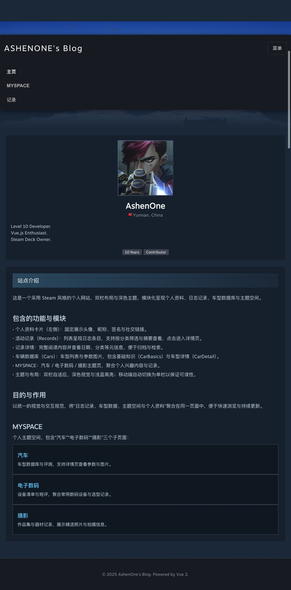
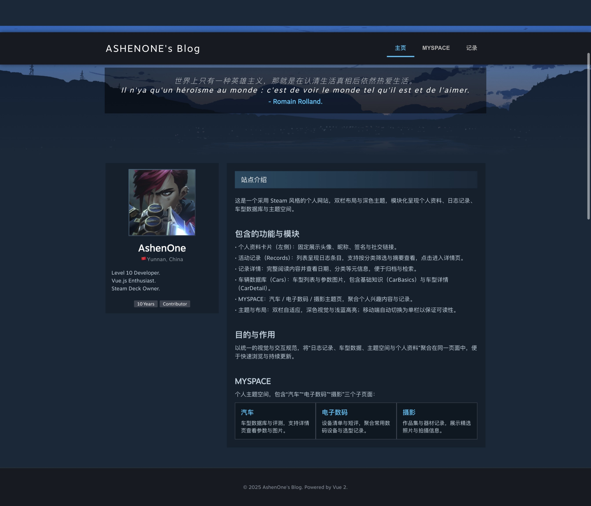

# ASHENONE's Personal Blog

 

> 一个基于 Vue 2的 Steam 风格个人博客，追求极速、优雅与现代化内容展示。

## 1. 特性 (Features)

- ⚡ 极速：基于 Vue 2 组合式 API 与 Vite，HMR 毫秒级热更新
- 📦 零配置：内置 TypeScript、ESLint、Prettier、自动引入，克隆即可开发
- 🎨 主题随心：CSS 变量 + UnoCSS 原子化，一键切换亮色 / 暗色 / Steam 经典绿
- 🧩 组件即页面：Markdown 渲染、Shiki 代码高亮、Giscus 评论、标签云、归档、友链等全部封装为 `<Blog*>` 组件
- 📚 依赖精简：仅保留核心依赖，Tree-Shaking 后产物 < 150 kB（gzip）

## 2. 历史版本变化

v1版本
> 基于纯 HTML + CSS 的静态页面，功能较为简单只具备基础功能，仅支持桌面端浏览  


v2版本
> 迁移至 Vue 2，引入响应式布局，**重构多个页面逻辑和布局**，仅支持桌面端浏览


v3版本（最新版）
> 优化多个页面的样式布局和交互，**新增移动端适配（重大更新）**
移动端：  
  
桌面端：  


</details>

## 3. 功能更新
> 新增记录页的热力图展示
> ！[记录页热力图](./src/assets/images/showPic/Records_v2.jpeg)
> 新增LEARNING页，展示个人学习记录

## 4. 安装 (Installation)

Node.js ≥ 18 与 pnpm ≥ 8 为推荐环境；npm / yarn 亦可。

```bash
# 克隆项目
git clone https://github.com/AshenoneZJX/AshenoneZJX.github.io.git

# 进入目录
cd AshenoneZJX.github.io

# 安装依赖
npm install

# 开发启动
npm run serve

# 同步部署到 GitHub Pages
1. npm run build
2. sh deploy.sh
```