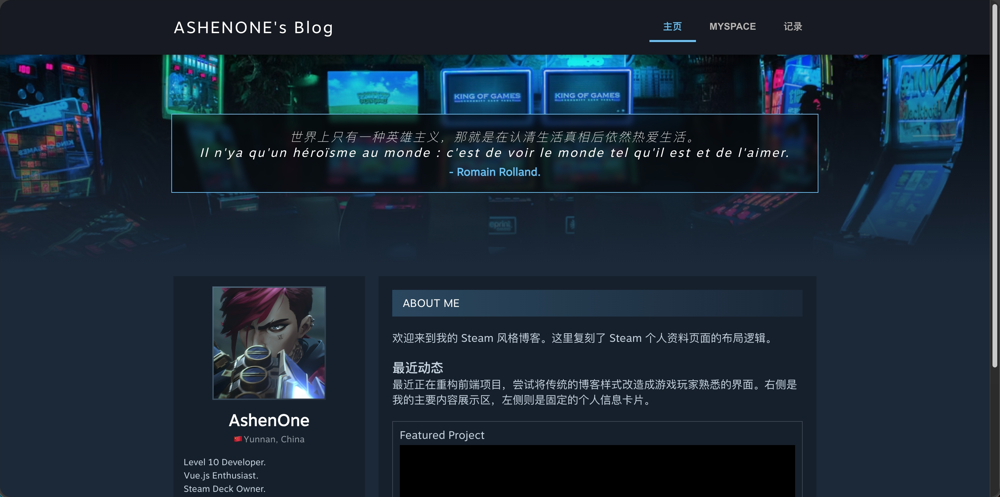

# ASHENONE's Personal Blog

 

> 一个基于 Vue.js 2.x 的 Steam 风格个人博客，专注于快速、优雅的内容展示。

## 1. 特性 (Features)

- 🚀 快速：基于 Vue.js 2.x 与 Vue CLI，开发与构建高效
- 📦 开箱即用：路由与组件已配置，克隆、安装、启动即可使用
- 🎨 可定制：组件化设计，轻松扩展主题与页面模块
- 🧩 组件化：内置 Markdown 渲染、代码高亮、评论、标签云、文章归档等常用博客组件  
- 📚 依赖丰富：集成 Vue-Router、Vuex、Axios、Markdown-it、Prism.js、LeanCloud 等主流依赖包，开箱即用

## 2. 截图 / 演示 (Screenshots)


*(SPA 项目展示首页效果)*

## 3. 安装 (Installation)

确保你的环境已安装 Node.js 12+ 与 npm 6+。

```bash
# 克隆项目
git clone https://github.com/AshenoneZJX/AshenoneZJX.github.io.git

# 进入目录
cd AshenoneZJX.github.io

# 安装依赖
npm install

# 开发启动
npm run serve

# 同步部署到 GitHub Pages
1. npm run build
2. sh deploy.sh
```