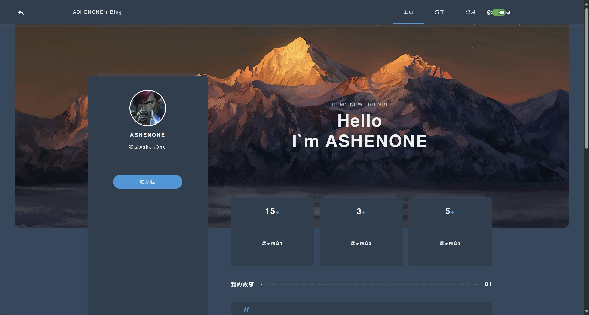

# ASHENONE's Personal Blog

一个基于 Vue.js 2.x 构建的个人博客网站，采用 **Steam 个人资料风格** 的 UI 设计，旨在展示个人简介、技能树和开发动态。



## 🌟 项目特色

- **Steam 风格 UI**: 复刻经典的 Steam 个人资料页布局，给极客和玩家亲切的视觉体验。
- **SPA 单页应用**: 使用 Vue Router 进行路由管理，提供流畅的无刷新页面切换体验。
- **组件化开发**: 采用现代化的组件结构，包含独立的导航栏、个人资料卡片等。
- **响应式设计**: 适配桌面端和移动端显示。
- **暗黑模式**: 默认采用深色主题，护眼且极具科技感。

## 🛠️ 技术栈

- **前端框架**: Vue.js 2.6.11
- **路由管理**: Vue Router 3.x
- **构建工具**: Vue CLI 4.5.19
- **样式处理**: Scoped CSS + Flexbox/Grid 布局
- **代码规范**: ESLint + Vue 官方规范

## 📁 项目结构

```
src/
├── components/          # 公共组件
│   ├── NavBar.vue       # 顶部导航栏
│   └── ProfileCard.vue  # 左侧个人信息卡片
├── views/               # 页面视图
│   ├── Home.vue         # 主页 (Steam 风格概览)
│   ├── Cars.vue         # 汽车爱好展示页
│   └── Records.vue      # 活动日志与待办事项
├── router/              # 路由配置
│   └── index.js
├── assets/              # 静态资源 (图片、样式等)
├── App.vue              # 根组件
└── main.js              # 入口文件
```

## 🚀 快速开始

### 环境要求

- Node.js >= 12.0.0
- npm >= 6.0.0

### 安装依赖

```bash
npm install
```

### 开发模式

启动开发服务器，支持热重载：

```bash
npm run serve
```

访问 `http://localhost:8080` 查看网站。

### 生产构建

构建生产版本：

```bash
npm run build
```

构建文件将输出到 `dist/` 目录。

## 📝 开发计划 (To-Do)

当前正在进行的优化项：
- [ ] **子页面完善**: 丰富 Cars 和 Records 页面的内容与交互。
- [ ] **字体优化**: 统一全站字体风格，提升阅读体验。
- [ ] **部署**: 自动化部署到 GitHub Pages。

## 👤 作者

**ASHENONE**

- 个人博客: [AshenoneZJX.github.io](https://AshenoneZJX.github.io)

---

*"只有一种英雄主义，那就是在认清生活真相后依然热爱生活。"*
