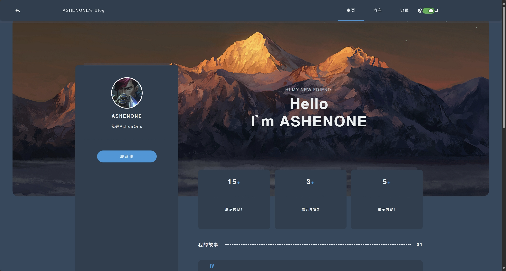
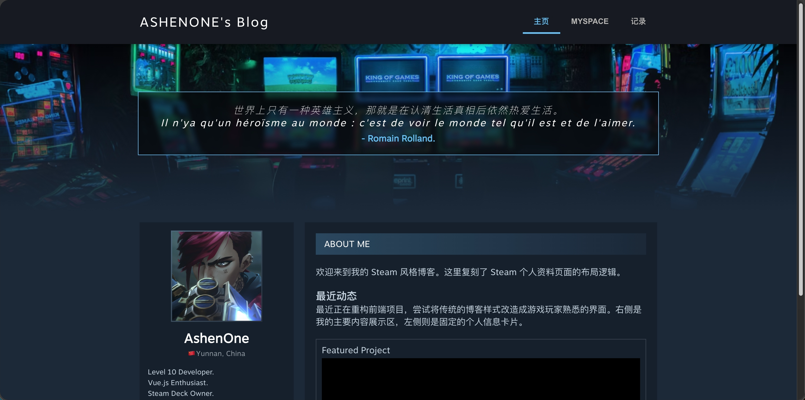
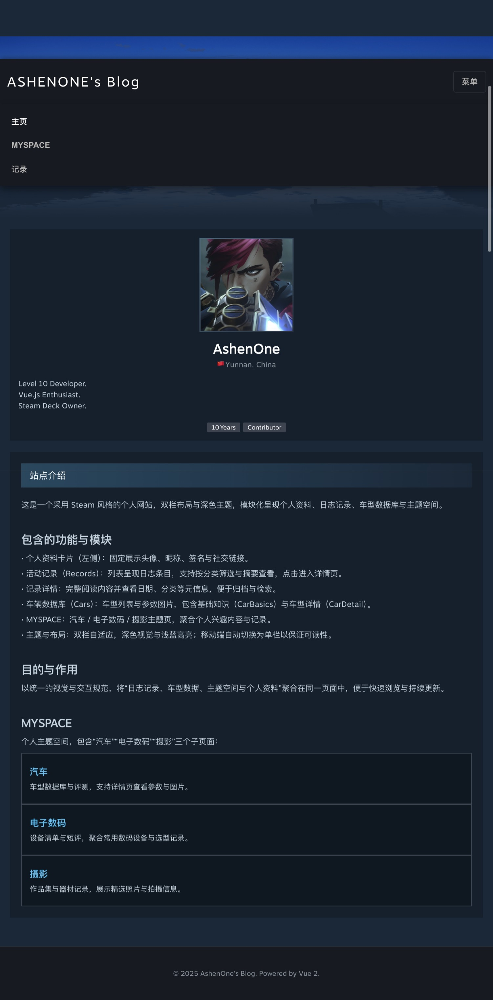
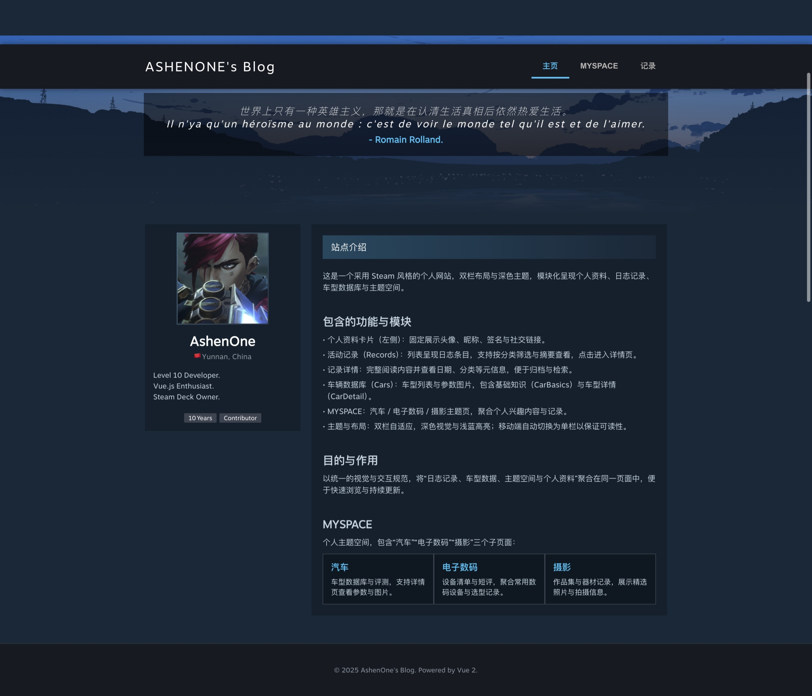
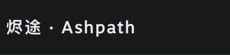
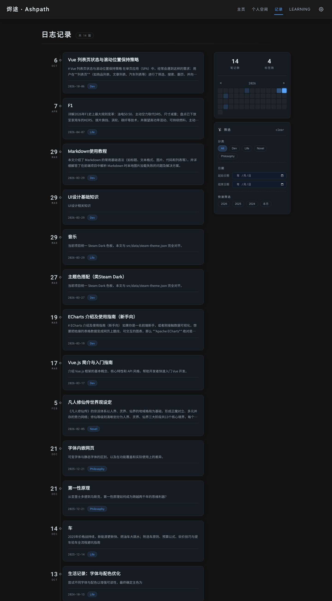
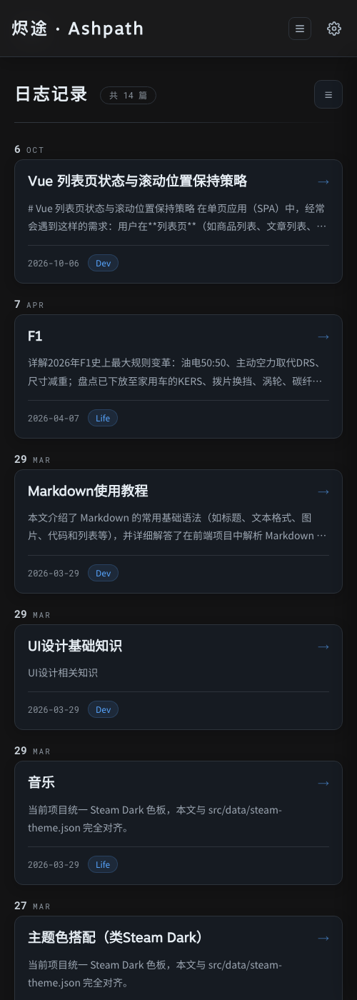
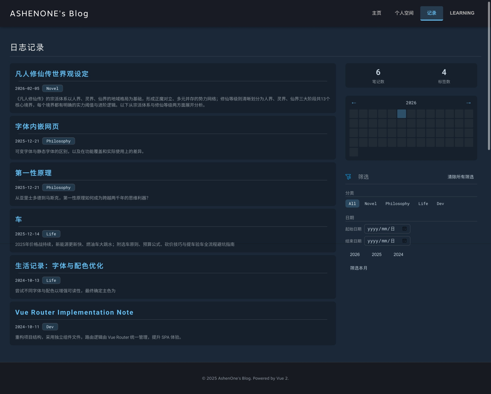
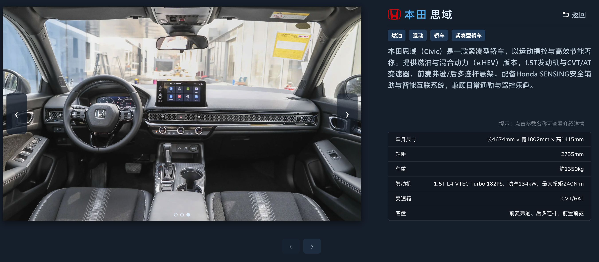

# 烬途 | Ashpath

 

> 基于 Vue 3 + TypeScript + Vite 的 Steam 风格个人博客，追求极速、优雅与现代化内容展示。

## 1. 特性 (Features)

- ⚡ 极速：Vue 3 组合式 API + Vite 4，HMR 毫秒级热更新
- 📦 零配置：内置 TypeScript、ESLint、Prettier、自动引入，克隆即可开发
- 🎨 主题随心：CSS 变量 + UnoCSS 原子化，一键切换亮色 / 暗色 / Steam 经典绿
- 🧩 组件即页面：Markdown 渲染、Shiki 代码高亮、Giscus 评论、标签云、归档、友链、记录热力图、学习进度等全部封装为 `<Blog*>` 组件
- 📱 多端适配：响应式布局，完美支持桌面与移动端
- 📚 依赖精简：仅保留核心依赖，Tree-Shaking 后产物 < 150 kB（gzip）

## 2. 历史版本变化

v1版本
> 基于纯 HTML + CSS 的静态页面，功能较为简单只具备基础功能，仅支持桌面端浏览  


v2版本
> 迁移至 Vue 2，引入响应式布局，**重构多个页面逻辑和布局**，仅支持桌面端浏览


v3版本（最新版）
> 优化多个页面的样式布局和交互，**新增移动端适配（重大更新）**
移动端：  
  
桌面端：  


v4版本（最新版）
> 全站更名 **烬途 | Ashpath**：全新篝火 Favicon、站点标题与描述更新、专属 404 页面  
>   
> **记录页 UI 现代化重构**：时间线归档布局、主题色联动热力图，移动端自适应  
> 桌面端：  
>   
> 移动端：  
> 

</details>

## 3. 更新

### 3.1 功能更新
> 新增记录页的热力图展示  
>   
> 新增LEARNING页，展示个人学习记录   
> 重构汽车详情页，优化信息层级与视觉动线，提升浏览体验  
> 

### 3.2 问题修复
> 路由模式调整：为兼容 GitHub Pages 的静态托管，将 history 模式改为 hash 模式，避免刷新 404；同时统一 base 路径为 `/`，解决子资源加载失败问题

### 3.3 v4.0 版本更新

**站点更名：烬途 | Ashpath**
> 踏灰烬而行，记录代码实践、技术思考与旅途札记。

- 站点标题、导航 Logo 更新为「烬途 · Ashpath」，新增搜索引擎描述的 meta description
- 新增单线篝火 `favicon.svg`（深/浅双主题描边配色），替换原 tiger 图标
- 新增 404 页面，文案「前路断绝，唯有余烬尚存。」；页脚更新为 Ashpath © 2026

**记录页（Records）UI 现代化重构**
> 功能零变更，仅重做视觉与信息层级。

- 文章列表改为**时间线归档**：左侧日期列（日 + 月份缩写）+ 连续时间轴 + 节点圆点，hover 高亮联动
- 卡片化设计：统一圆角、细边框与主题色辉光，保留入场动画与全部筛选交互
- 侧栏改为吸顶布局：统计卡 + 筛选卡（胶囊化筛选按钮、区块虚线分隔）
- **配色接入全局主题变量**：热力图色阶跟随设置页主题色实时联动（原为硬编码蓝）
- 移动端：时间线收起为行内日期，筛选抽屉 / 遮罩 / 触发按钮行为保持不变

## 4. 安装 (Installation)

Node.js ≥ 18 与 pnpm ≥ 8 为推荐环境；npm / yarn 亦可。

```bash
# 克隆项目
git clone https://github.com/AshenoneZJX/AshenoneZJX.github.io.git

# 进入目录
cd AshenoneZJX.github.io

# 安装依赖
npm install

# 开发启动
npm run serve

# 同步部署到 GitHub Pages
sh deploy.sh
```